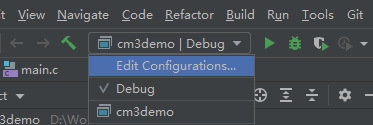
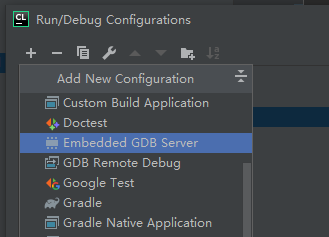
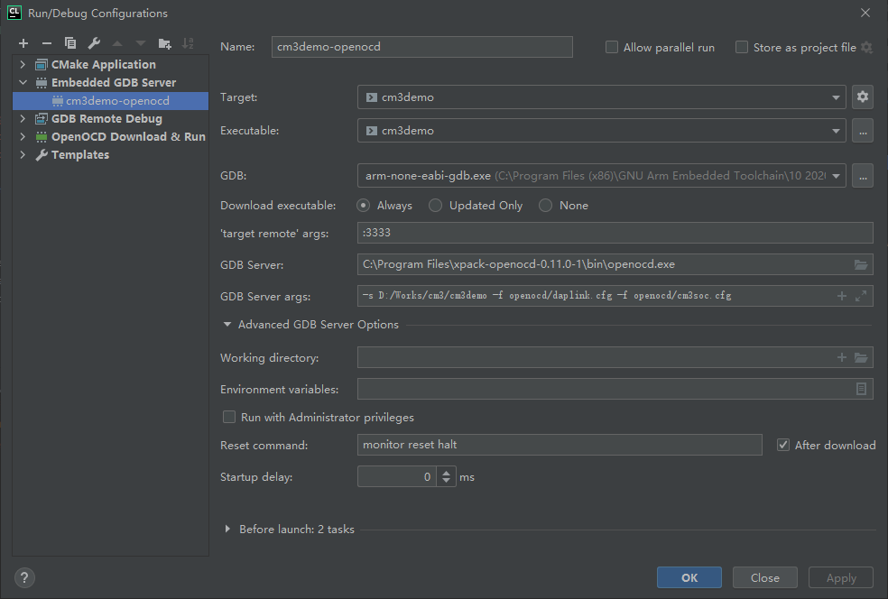

# Cortex-M3 软核处理器快速上手指南 (软件篇)
* [准备工具](#准备工具)
  * [软件工具](#软件工具)
  * [硬件工具](#硬件工具)
* [文件结构](#文件结构)
* [软件安装说明](#软件安装说明)
  * [安装 CLion](#安装-clion)
  * [下载 GNU Toolchain 和 OpenOCD](#下载-gnu-toolchain-和-openocd)
* [生成 BSP (Board Support Package, 板级支持包)](#生成-bsp-board-support-package-板级支持包)
* [IDE 及编译环境配置](#ide-及编译环境配置)
  * [配置工具链路径](#配置工具链路径)
  * [测试编译情况](#测试编译情况)
* [测试调试器](#测试调试器)
* [在 CLion 中添加调试选项](#在-clion-中添加调试选项)
* [参考资料](#参考资料)

## 准备工具
### 软件工具
- [CLion](https://www.jetbrains.com/clion/) (IDE)
- [GNU Arm Embedded Toolchain](https://developer.arm.com/tools-and-software/open-source-software/developer-tools/gnu-toolchain/gnu-rm/downloads) (GNU 工具链，用于编译程序)
- [OpenOCD](https://github.com/xpack-dev-tools/openocd-xpack/releases) (调试器软件)
- cm3demo 代码

### 硬件工具
- 烧写了 Cortex-M3 SoC 的 FPGA 开发板（见[硬件快速上手指南](hardware-quickstart.md)）
- 可用于 Cortex-M3 的 JTAG/SWD 调试器，如：
    - 兼容 CMSIS-DAP/DAPLink 的调试器 [nanoDAP](https://item.taobao.com/item.htm?id=586425846353)
    - Xilinx FPGA 开发板使用的 [JTAG 调试器](https://detail.tmall.com/item.htm?id=572183866064) (主控芯片为 FT232H)
    - ......

## 文件结构
- **[bsp](../bsp)**: 板级支持包代码
- **[CMSIS](../CMSIS)**: 简单的 CMSIS 支持代码
- **[openocd](../openocd)**: OpenOCD 的配置文件目录
- **[.gitignore](../.gitignore)**: 不添加至 Git 仓库的文件列表
- **[cm3soc.lds](../cm3soc.lds)**: 程序的链接脚本，控制在程序链接过程中将代码、数据放置在哪个内存地址
- **[CMakeLists.txt](../CMakeLists.txt)**: CMake 的编译配置脚本，包含了要编译的文件的列表、编译器配置、编译选项等
- **[main.c](../main.c)**: main.c
- **[startup.c](../startup.c)**: 启动代码，包含了程序的中断向量表的定义、默认的中断函数、CPU 复位后程序的入口点 (System_Startup 函数，该函数会调用 CRT 的初始化函数，随后进入 main 函数)、
- **[sys_irq_handlers.c](../sys_irq_handlers.c)**: 定义了系统异常的处理函数，在发生异常后暂停时可以看出发生了什么异常导致，如 Hard Fault, Memory Fault 等

## 软件安装说明
### 安装 CLion
直接下载安装即可，可以使用学校邮箱获得 JetBrains 的免费[教育版许可](https://www.jetbrains.com/community/education/) 。

### 下载 GNU Toolchain 和 OpenOCD
将 GNU Toolchain 和 OpenOCD 下载后解压至任意位置即可，如以下示例中将文件分别解压到了
```C:\Program Files (x86)\GNU Arm Embedded Toolchain\10 2020-q4-major``` 和 ```C:\Program Files\xpack-openocd-0.11.0-1```。

## 生成 BSP (Board Support Package, 板级支持包)
这一步已经完成了，可以跳过。BSP 中主要是外设的操作库代码，它将外设的寄存器级操作封装成了函数调用。

如果修改了 SoC 上的外设 (如添加或删除外设、修改外设的地址空间)，则应将 BSP 同时重新生成。

BSP 的生成步骤见[硬件快速上手指南](hardware-quickstart.md)。

## IDE 及编译环境配置
### 配置工具链路径
用 CLion 打开工程文件夹，随后设置 GNU Toolchain 路径。打开 ```File -> Settings -> Build, Execution, Deployment -> CMake```，在
CMake Options 中填写以下内容 (需要将路径中的 "```\ ```" 改为 "```/```")：
```
-DGNU_TOOLCHAIN_PATH="C:/Program Files (x86)/GNU Arm Embedded Toolchain/10 2020-q4-major"
```
其中 ```GNU_TOOLCHAIN_ROOT``` 属性对应的是工具链的根目录，此时
```C:/Program Files (x86)/GNU Arm Embedded Toolchain/10 2020-q4-major/bin/arm-none-eabi-gcc.exe``` 应是 gcc 可执行文件的路径。


### 测试编译情况
点击菜单栏中的 ```Build -> Build 'cm3demo'```，开始编译项目。随后弹出的 Messages 窗口中若出现 Build finished 字样，没有出现任何错误，则说明编译正常，随后可以继续测试调试器。


## 测试调试器
在 FPGA 开发板烧写完成后，将调试器 (如 nanoDAP) 连接至 FPGA 开发板上的调试接口。调试器可以通过 JTAG 或 SWD 协议调试 Cortex-M3 处理器核，如果使用 **JTAG** 协议，请连接以下引脚：

| 调试器端 | 开发板端 |
| --- | --- |
| GND | GND |
| TMS | TMS |
| TCK | TCK |
| TDI | TDI |
| TDO | TDO |

如果使用 **SWD** 协议，则应连接以下引脚：

| 调试器端 | 开发板端 |
| --- | --- |
| GND | GND |
| SWCLK | SWCLK |
| SWDIO | SWDIO |
| SWO | SWO |

接着将调试器的 USB 接口插入电脑，并在 OpenOCD 中测试连接情况。打开 PowerShell，运行
```&"C:\Program Files\xpack-openocd-0.11.0-1\bin\openocd.exe" -s D:/Works/cm3/cm3demo -f openocd/daplink.cfg -c 'scan_chain'```
命令，其中：
- ```C:\Program Files\xpack-openocd-0.11.0-1\bin\openocd.exe``` 是 OpenOCD 的可执行文件路径
- ```-s``` 选项指明 OpenOCD 配置的搜索路径，```D:/Works/cm3/cm3demo```是工程的根目录
- ```-f``` 选项指明需要加载的 OpenOCD 配置文件，这里指定了 [```openocd/daplink.cfg```](../openocd/daplink.cfg) 这个配置文件，其中包含了调试器硬件的配置信息，如调试器的硬件类型、传输速率、选择的传输协议 (这个文件里选择的是 JTAG)。
- ```-c``` 选项指明要执行的命令，如此处的 ```scan_chain``` 表示运行 JTAG 的边界扫描，这条命令可以列举 JTAG 扫描链上的设备。
  
如果这条命令的运行结果中包含如下文本，则表示 JTAG 调试器已经正常配置，而且成功地识别了待调试的对象，这里的 ```0x4ba00477```就是 Cortex-M3 处理器的 ID。
```
Info : JTAG tap: auto0.tap tap/device found: 0x4ba00477 (mfg: 0x23b (ARM Ltd.), part: 0xba00, ver: 0x4)
Warn : AUTO auto0.tap - use "jtag newtap auto0 tap -irlen 4 -expected-id 0x4ba00477"
```
如果一切正常，那就可以按下 ```Ctrl```+```C``` 结束 OpenOCD 的程序，随后即可在 CLion 中连接 OpenOCD 进行调试了。

## 在 CLion 中添加调试选项
点击上方的运行目标按钮(如图)，并点击 ```Edit Configurations...```



在弹出的对话框中添加运行配置，点击 + 按钮，点击
Embedded GDB Server 创建一个使用 GDB 服务器进行运行和调试的配置。



随后按如下方式修改配置：
- **Executable** 选择为 cm3demo (这个是 CMake 的编译输出)
- **GDB** 选择为 GNU Toolchain 中的 GDB 路径，如```安装目录/bin/arm-none-eabi-gdb.exe```
- **'target remote' args** 填写 ```:3333```，这个是 OpenOCD 启动后 GDB Server 默认的监听端口号，调试时 CLion 会通过上面的
  ```arm-none-eabi-gdb.exe```连接这个端口
- **GDB Server** 填写 OpenOCD 可执行文件的位置，如 ```C:\Program Files\xpack-openocd-0.11.0-1\bin\openocd.exe```
- **GDB Server args** 填写 ```-s D:/Works/cm3/cm3demo -f openocd/daplink.cfg -f openocd/cm3soc.cfg```
  这里的参数与前面的相似，而后一个文件  [```openocd/cm3soc.cfg```](../openocd/cm3soc.cfg) 包含了调试目标的配置，如 CPU 信息等。

展开 Advanced GDB Server Options 

- **Reset command** 填写 ```monitor reset halt```

上方的 **Name** 可以随便填一个有意义便于识别的名字



点击 OK 添加调试配置，随后点击上方的调试按钮即可开始调试。


如果一切正常，那程序就可以正常运行了，cm3demo 中的程序会让 GPIO 0 的 0、1 引脚上连接的LED小灯交替闪烁，同时使用 axi_uartlite_0 在串口上输出文本。


## 参考资料

1. *[Arm Cortex-M3 DesignStart FPGA-Xilinx edition User Guide](https://developer.arm.com/documentation/101483/latest)*: DesignStart 开发包中自带的示例设计的说明，除了 Vivado 中的配置说明外还包含了内存区域的划分表、使用 Keil 进行软件开发的流程等
   
1. *[Cortex-M3 Technical Reference Manual](https://developer.arm.com/documentation/ddi0337/e)*: 包含了 Cortex-M3 处理器核内的架构图、内存模型、指令集、处理器私有外设（如 MPU、NVIC、SysTick) 、调试接口的简单说明等内容

注：以上两个文档在 [DesignStart FPGA 开发包](https://developer.arm.com/ip-products/designstart/fpga) 中可以找到

3. *[Cortex-M3 Devices Generic User Guide](https://developer.arm.com/documentation/dui0552/latest/)*: 更加详细的指南，更倾向于软件开发的说明

1. *[OpenOCD 用户手册](https://openocd.org/doc/html/index.html)*: OpenOCD 的用户手册，可以找到 OpenOCD 的配置文件的编写方法、命令说明等
  
1. *[https://jacobmossberg.se/posts/2017/01/10/using-openocd-flash-arm-cortex-m3.html](https://jacobmossberg.se/posts/2017/01/10/using-openocd-flash-arm-cortex-m3.html)*: 另一个用 OpenOCD 调试 Cortex-M3 处理器的教程
